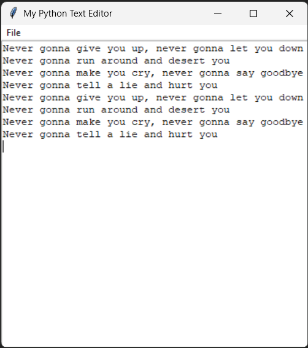

# 📝 Notepad Clone

A lightweight **Notepad clone** built with **Python (Tkinter)**.  
It allows you to create, open, edit, and save text files in a simple GUI.

---

## ⚙️ Tech Stack


---

## 🚀 Features
- Create new text files
- Open existing `.txt` files
- Save and Save As functionality
- Simple and lightweight GUI using Tkinter
- Packaged into an `.exe` for easy use (Windows)

---

## 📂 Project Structure
Text_Editor/
│── textEditor.py # Main source code
│── .gitignore # Git ignore file
│── dist/ # Generated exe (not in repo, available in Releases)

---

## ▶️ How to Run (Source Code)

1. Clone the repo:
   ```bash
   git clone https://github.com/iaamhammad/Notepad-Clone.git
   cd Notepad-Clone
   ```
2. Run the Python file:
   ```python textEditor.py```

---

🏗️ How to Build the EXE

If you want to build your own .exe file:
   ```bash
   pip install pyinstaller
   pyinstaller --onefile --windowed textEditor.py
   ```

The executable will be inside the dist/ folder.

---

📥 Download EXE

[](https://github.com/iaamhammad/Notepad-Clone/releases)
[](https://github.com/iaamhammad/Notepad-Clone/releases)

You can download the pre-built .exe from the Releases section.

---



---

👨‍💻 Author

Hammad Muhammad
📌 GitHub: @iaamhammad
